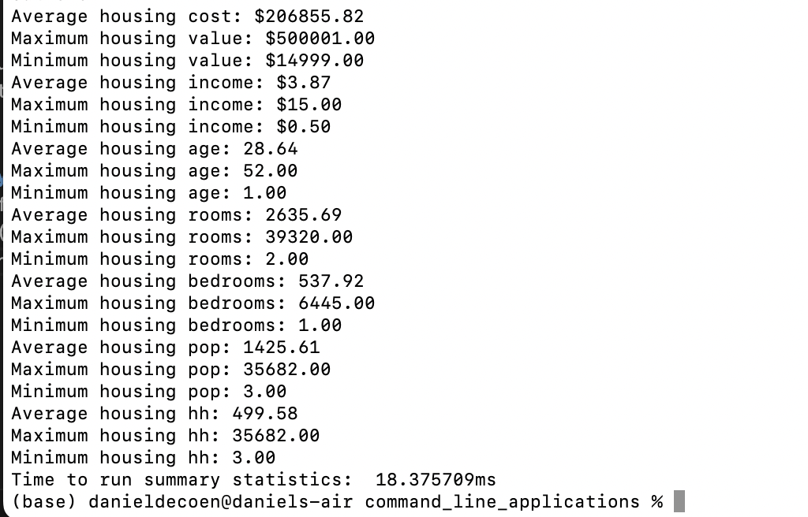
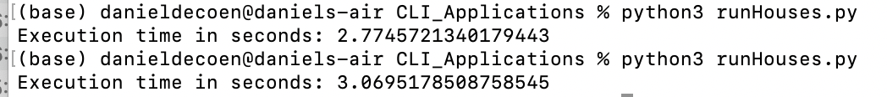
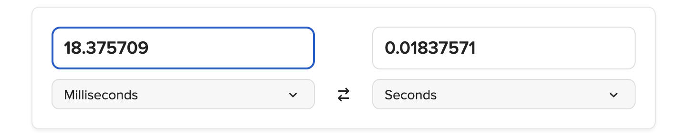

# command_line_applications

## Goal: Create an app that reads in California Housing Data via Go and calculates summary statistics such as average, max, and min similar to Python Pandas Describe.

1. Read in the CSV Data
2. Calculate the average, max, and min for all the columns
3. Print the results to the screen with execution time.
4. Save as an application file.

## Analysis of Go for Summary Statistics
Coming from a Python/Pandas backgroud, the actual code was much easier in Python (less than 15 lines), and it was much quicker to write. The difference lies in the execution time with Go coming in around 20 microseconds, while the Python code was coming in around 2 seconds. 

The performance was almost 100x faster with Golang. 

To be fair to Pandas, the time it took to write the Golang functions took much longer, but now that both codes are completed, it would make more sense to use GoLang going forward, especially if this code will be used throughout the organization. If this is still an exercise completed by just one analyst on one workstation, Python or R may still be the way to go (no pun intended).
